# 🖥️ screen-flow.md

> 本ドキュメントは `Web App` と `Slack` の2チャネルの遷移設計を対象とする。Web Appは本プロダクトが直接実装する画面、Slackはコマンド/モーダル/スレッド/アクションを含む操作遷移として定義する。Slackクライアント固有UIの細かな挙動は制御対象外。なお、Slack連携（Events API）の認証情報と、Webアプリ利用者のログイン認証は分離して扱う。

---

# 0 設計前提

| 項目     | 内容 |
| ------ | ---- |
| 対象ユーザー | ログイン済みメンター / Slack参加ユーザー |
| 対象チャネル | Web App / Slack |
| デバイス   | ブラウザが利用可能な端末 + Slackクライアントが利用可能な端末 |
| 認証要否   | Webは全面認証制、Slackはワークスペース認証済みユーザーを前提 |
| 権限制御   | RBAC（Mentorのみ） |
| MVP範囲  | P0画面とP0 Slack操作（質問対応とチーム状況確認に必要な最小機能） |

※ 将来要件として、必要になった場合は「Mentorは自分の担当チームのみ閲覧可能」というチームスコープ制御を追加する。

---

# 1 画面/操作面一覧（Screen Inventory）

## 1-1. Web App

| ID   | 画面名 | 役割 | 認証 | 優先度 |
| ---- | ---- | ---- | ---- | ---- |
| S-01 | ログイン | Webアプリ独自認証（メンターのみ） | 不要 | P0 |
| S-02 | 質問キュー | `/question` 起点の質問一覧・優先度確認 | 必須 | P0 |
| S-03 | 質問詳細 | AI一次回答ログ確認・メンター対応ステータス更新 | 必須 | P0 |
| S-04 | 進捗Overview | 全チームの進捗サマリー確認 | 必須 | P0 |
| S-05 | チーム進捗詳細 | 指定チームの進捗投稿履歴確認 | 必須 | P0 |

---

## 1-2. Slack

| ID   | 操作面 | 役割 | 認証 | 優先度 |
| ---- | ---- | ---- | ---- | ---- |
| L-01 | 質問コマンド入力 | 質問フロー開始（テンプレ入力） | 必須（Slack認証） | P0 |
| L-02 | 質問スレッド | AI一次回答・不足情報ヒアリング・メンター応答 | 必須（Slack認証） | P0 |
| L-03 | Issue化アクション | 質問/議論をIssue草案へ変換 | 必須（Slack認証） | P0 |
| L-04 | 進捗コマンド入力 | 進捗フロー開始（モーダル入力） | 必須（Slack認証） | P0 |
| L-05 | 進捗投稿チャンネル | 進捗投稿の共有と同期結果の起点 | 必須（Slack認証） | P0 |

---

# 2 全体遷移図（高レベル）

## 2-1. Web App

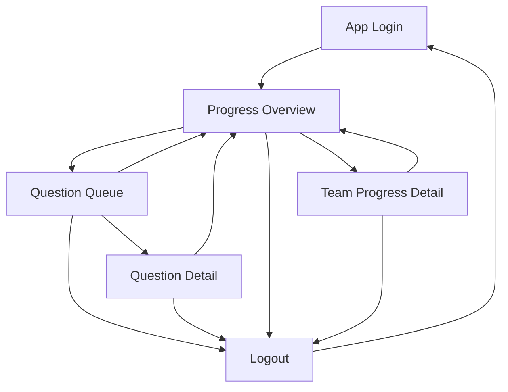

---

## 2-2. Slack

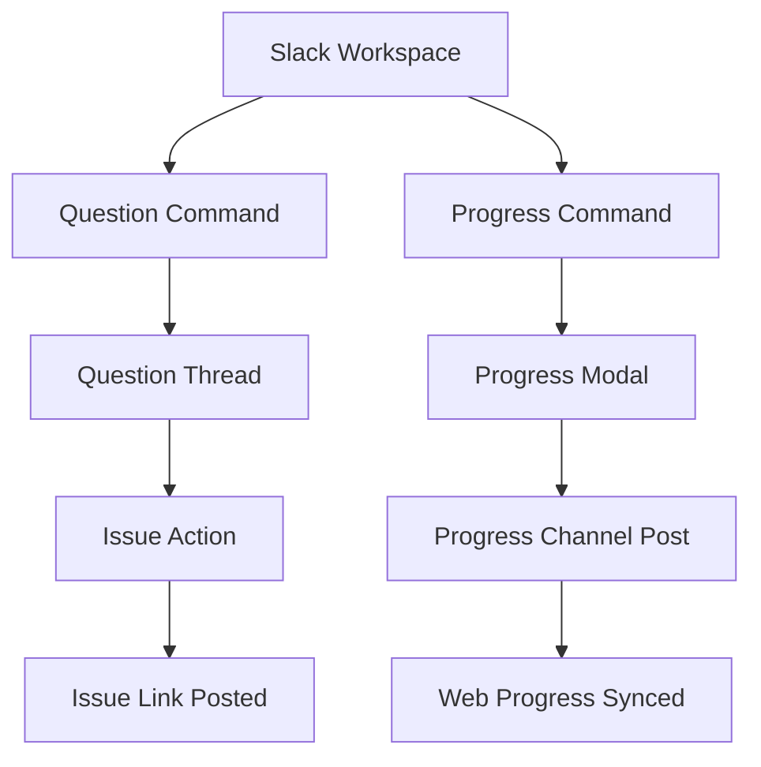

---

# 3 認証フロー

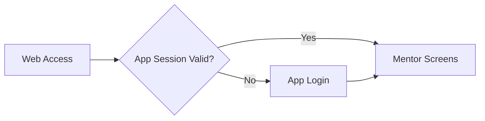

---

# 4 CRUD標準遷移テンプレ（Web App）

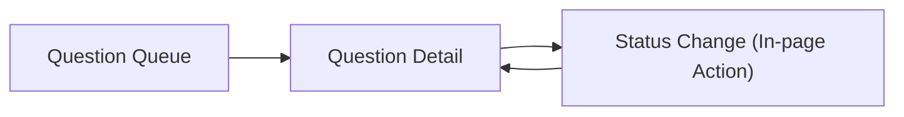

---

# 5 状態別分岐（State-based Flow / Web App）

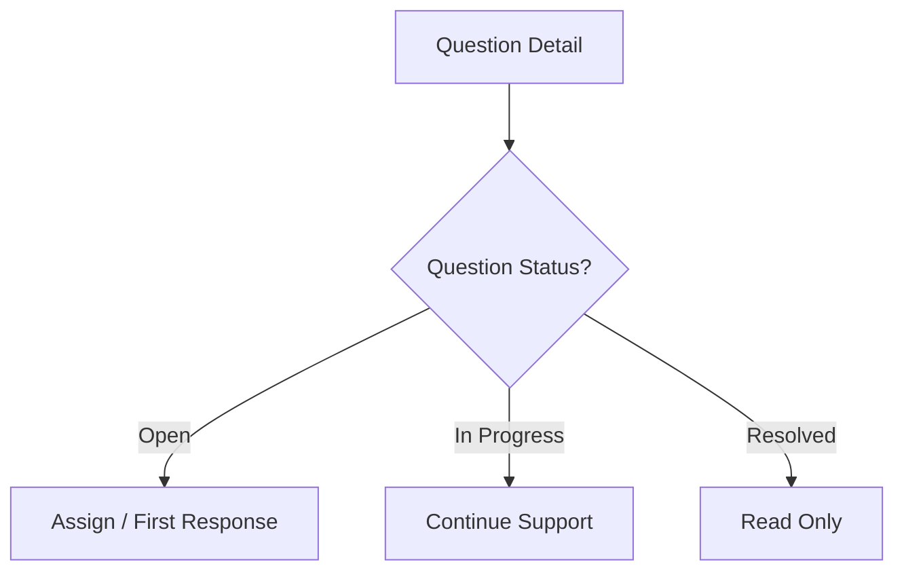

---

# 6 権限制御（Web App / Slack）

現時点ではロールは `Mentor` のみで、Web画面アクセスとSlack操作の権限分岐は行わない。

---

# 7 モーダル・非同期操作（チャネル別）

- Web App（MVP）ではモーダル操作は採用しない。主要操作は画面遷移と通常のフォーム送信で実装する。
- Slackでは `/progress` 入力時にモーダルを利用し、送信後はBot投稿で非同期完了通知を返す。

---

# 8 エラーフロー（Web App ）

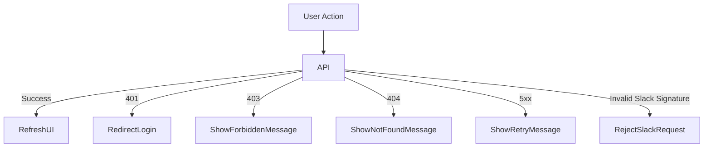

---

# 9 空状態 / 初回体験（Web App）

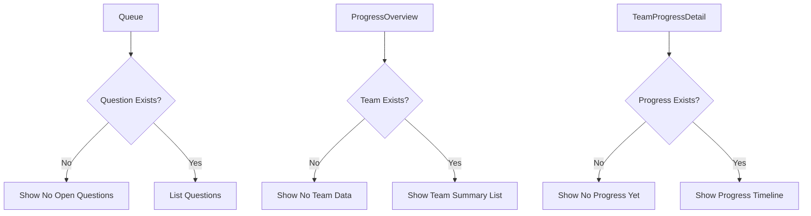

---

# 10 URL設計テンプレ（Web App）

| 画面ID | 画面名 | URL |
| ---- | ---- | ---- |
| S-01 | ログイン | `/login` |
| S-02 | 質問キュー | `/questions` |
| S-03 | 質問詳細 | `/questions/:questionId` |
| S-04 | 進捗Overview | `/progress` |
| S-05 | チーム進捗詳細 | `/progress/teams/:teamId` |

---

# 11 チャネル別シナリオ遷移（Web App / Slack）

## 11-1. 質問時

### Web App遷移

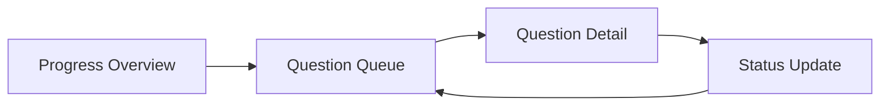

### Slack遷移

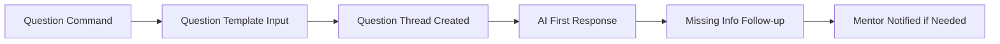

---

## 11-2. 質問後にIssueへ書き起こし

### Web App遷移

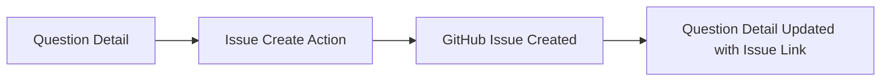

### Slack遷移

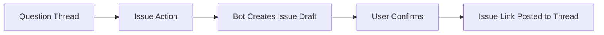

---

## 11-3. 進捗同期時

### Web App遷移

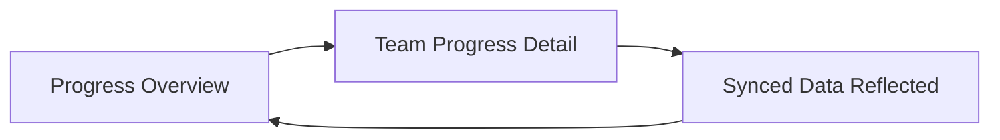

### Slack遷移

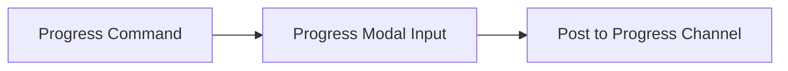
