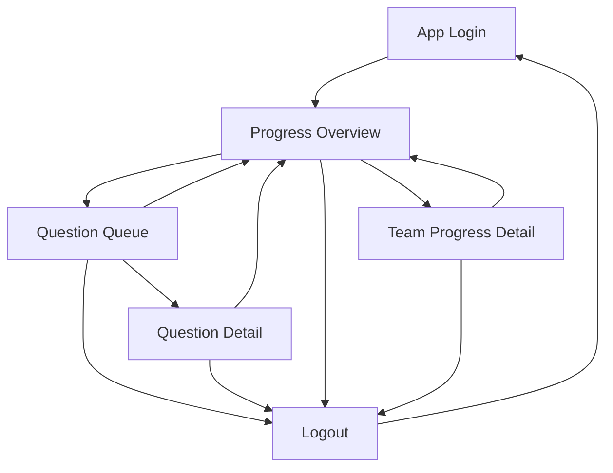
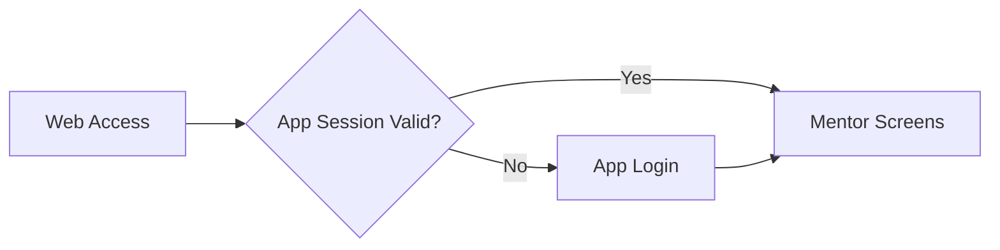
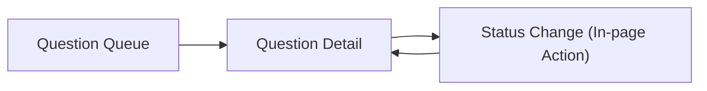
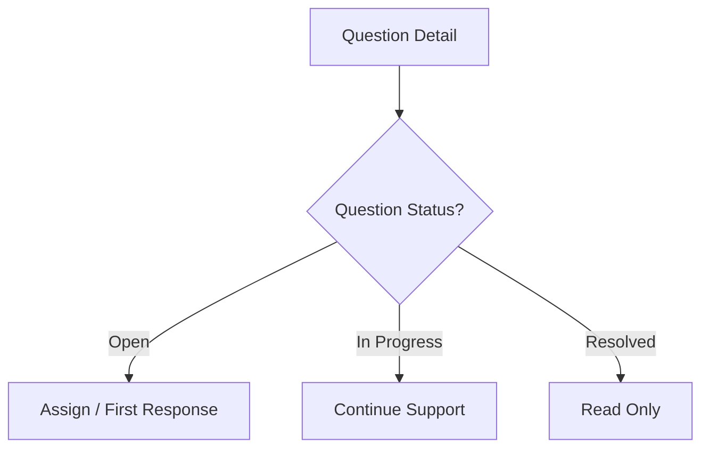
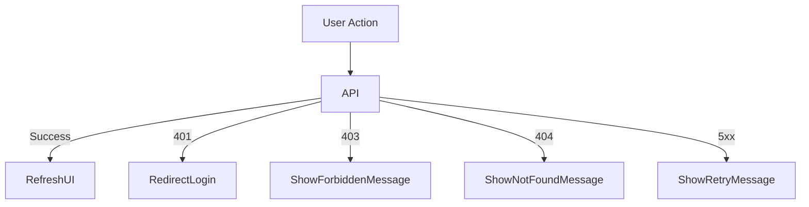
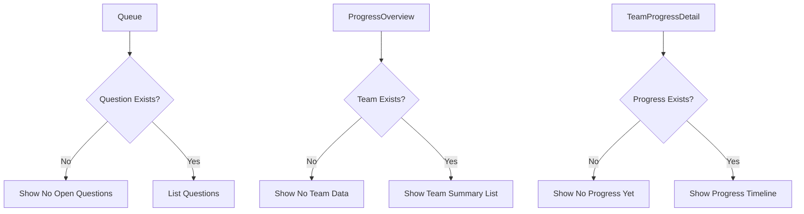

# 🖥️ screen-flow.md

> 本ドキュメントはWeb Appの画面設計のみを対象とする。Slackは外部プラットフォームとして扱い、Slackクライアント側のUI/挙動は本設計の制御対象外とする。なお、Slack連携（Events API）の認証情報と、Webアプリ利用者のログイン認証は分離して扱う。

---

# 0️⃣ 設計前提

| 項目     | 内容 |
| ------ | ---- |
| 対象ユーザー | ログイン済みメンター |
| デバイス   | ブラウザが利用可能な端末（PC / タブレット / スマートフォン） |
| 認証要否   | 公開ページなし（Webは全面認証制） |
| 権限制御   | RBAC（Mentorのみ） |
| MVP範囲  | P0画面のみ（質問対応とチーム状況確認に必要な最小画面） |

※ 将来要件として、必要になった場合は「Mentorは自分の担当チームのみ閲覧可能」というチームスコープ制御を追加する。

---

# 1️⃣ 画面一覧（Screen Inventory）

| ID   | 画面名 | 役割 | 認証 | 優先度 |
| ---- | ---- | ---- | ---- | ---- |
| S-01 | ログイン | Webアプリ独自認証（メンターのみ） | 不要 | P0 |
| S-02 | 質問キュー | `/question` 起点の質問一覧・優先度確認 | 必須 | P0 |
| S-03 | 質問詳細 | AI一次回答ログ確認・メンター対応ステータス更新 | 必須 | P0 |
| S-04 | 進捗Overview | 全チームの進捗サマリー確認 | 必須 | P0 |
| S-05 | チーム進捗詳細 | 指定チームの進捗投稿履歴確認 | 必須 | P0 |

---

# 2️⃣ 全体遷移図（高レベル）

---

# 3️⃣ 認証フロー

---

# 4️⃣ CRUD標準遷移テンプレ

---

# 5️⃣ 状態別分岐（State-based Flow）

---

# 6️⃣ 権限制御

現時点ではロールは `Mentor` のみで、画面アクセスの権限分岐は行わない。

---

# 7️⃣ モーダル・非同期操作

MVPではモーダル操作は採用しない。主要操作は画面遷移と通常のフォーム送信で実装する。

---

# 8️⃣ エラーフロー

---

# 9️⃣ 空状態 / 初回体験

---

# 🔟 URL設計テンプレ

| 画面ID | 画面名 | URL |
| ---- | ---- | ---- |
| S-01 | ログイン | `/login` |
| S-02 | 質問キュー | `/questions` |
| S-03 | 質問詳細 | `/questions/:questionId` |
| S-04 | 進捗Overview | `/progress` |
| S-05 | チーム進捗詳細 | `/progress/teams/:teamId` |
