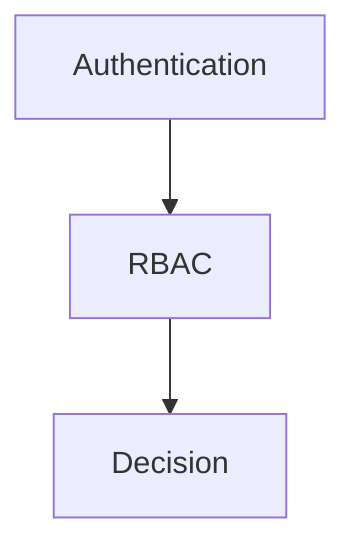

# 🔐 権限設計

---

# 0️⃣ 設計前提

| 項目 | 内容 |
| ---- | ---- |
| 権限モデル | RBAC（単一ロール） |
| マルチテナント | なし（MVP） |
| 認証方式 | Webアプリ独自認証（Session） |
| スコープ単位 | Global（MVP） |
| MVP方針 | `Mentor` ロールのみ運用 |

※ 将来要件として、必要になった場合は「Mentorは担当チームのみ閲覧可能」のスコープ制御を追加する。

---

# 1️⃣ 用語定義

| 用語 | 意味 |
| ---- | ---- |
| Subject | 操作主体（ログイン済みユーザー） |
| Resource | 操作対象（Question / Progress など） |
| Action | 操作内容（read / update） |
| Role | 権限グループ（MVPでは Mentor のみ） |
| Policy | 判定ルール（MVPでは最小） |

---

# 2️⃣ 権限レイヤー構造



---

# 3️⃣ RBAC設計

## 3-1. グローバルロール

| ロール名 | 説明 |
| ---- | ---- |
| MENTOR | Web画面（質問/進捗）の閲覧と質問ステータス更新が可能 |

---

## 3-2. スコープロール（組織単位）

MVPでは未採用。

将来、担当チーム限定閲覧を導入する場合は `mentor_team_assignments` でチームスコープを判定する。

---

## 3-3. RBAC判定ロジック（MVP）

```pseudo
if not authenticated:
    deny (401)
else if user.role != "MENTOR":
    deny (403)
else:
    allow
```

---

# 4️⃣ ABAC設計

## 4-1. 条件モデル

MVPではABACは未採用。

将来の条件例（担当チーム限定を入れる場合）:

```json
{
  "subject.role": "MENTOR",
  "resource.team_id": "in subject.assigned_team_ids"
}
```

---

## 4-2. ポリシーテーブル例

| ID | 名前 | Action | 条件 | Effect | Priority |
| -- | ---- | ------ | ---- | ------ | -------- |
| 1 | MentorOnly | * | role=MENTOR | allow | 10 |
| 2 | DefaultDeny | * | unmatched | deny | 1 |

---

## 4-3. 判定順序

```pseudo
1. 認証確認
2. RBAC判定（MENTORか）
3. allow / deny
```

---

# 5️⃣ ハイブリッド設計パターン

| レイヤー | 用途 |
| ---- | ---- |
| RBAC | 現在の本番判定（MENTORのみ許可） |
| ABAC | 将来の担当チーム限定閲覧で使用予定 |
| Feature Flag | 将来の段階的リリース時のみ利用 |

---

# 6️⃣ 代表的ルール

### 6-1. ログイン必須

```pseudo
if not isAuthenticated(user):
    deny
```

---

### 6-2. Mentorのみ許可

```pseudo
if user.role == "MENTOR":
    allow
else:
    deny
```

---

### 6-3. 将来: 担当チーム境界

```pseudo
if resource.team_id not in user.assigned_team_ids:
    deny
```

---

### 6-4. デフォルト拒否

```pseudo
deny by default
```

---

# 7️⃣ データモデル連携

| ルール | 参照カラム |
| ---- | ---------- |
| ロール判定 | users.role |
| アカウント有効判定 | users.is_active |
| 将来の担当チーム制御 | mentor_team_assignments.team_id |

---

# 8️⃣ ログ設計

## 8-1. 認可評価ログ

| フィールド | 内容 |
| ---- | ---- |
| actor | 実行者（ユーザーID） |
| name | ユースケース名 |
| version | パラメータスキーマのバージョン番号 |
| params | 実行パラメータ（JSON形式） |
| result | 成功時の結果（任意） |
| error | 失敗時のエラーメッセージ（任意） |

---

## 8-2. 監査ログ

MVPでは監査ログは収集しない。

---

# 9️⃣ APIレイヤー統合

MVPでは本ドキュメントにAPI実装コードは含めない。

---

# 🔟 フロントエンド制御

| パターン | 説明 |
| ---- | ---- |
| 未ログイン時リダイレクト | `/login` へ遷移 |
| 権限不足時表示 | 標準エラー画面（403） |
| 機能表示 | MVPではMentor向け機能のみ表示 |

※ フロントはUX制御のみ。最終判定は必ずサーバー側。
