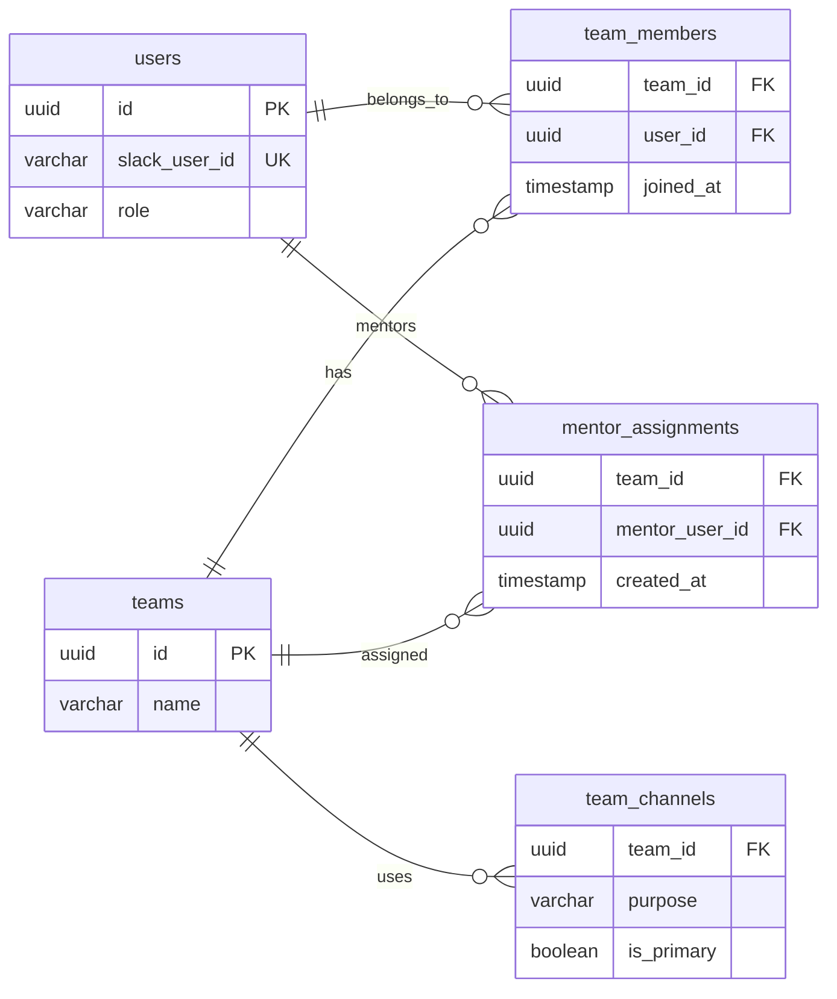
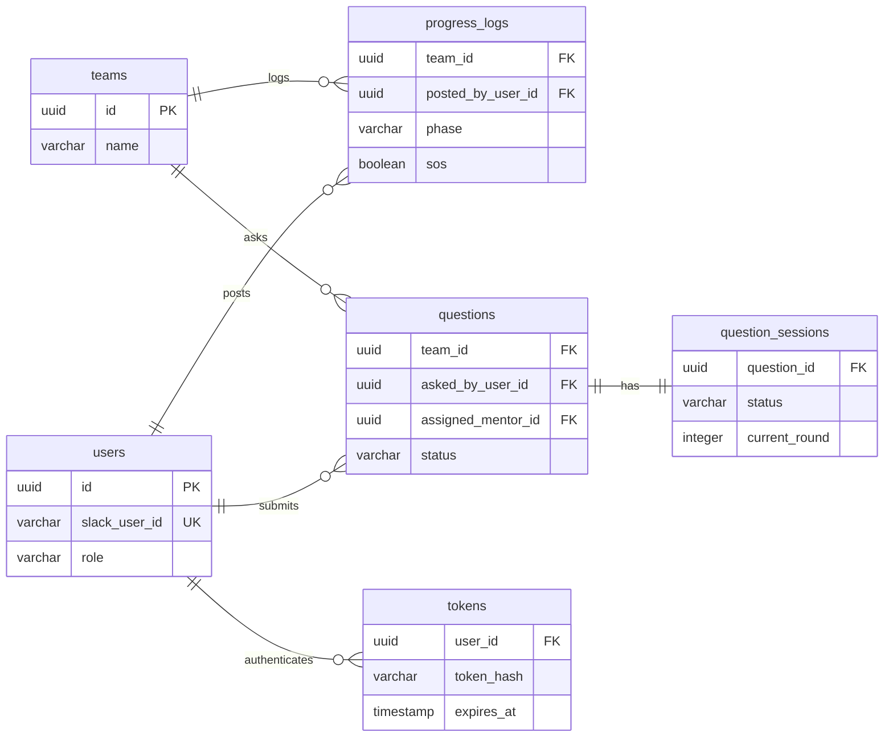

# 🗄️ DB設計書：KCL Progress Board

---

# 0 設計観点

| 項目 | 内容 |
| --- | --- |
| 権限モデル | RBAC（単一ロール: MENTOR） + チームスコープ |
| ID戦略 | UUID（全テーブル共通） |
| 論理削除 | 無（MVP） |
| 監査ログ | 任意（MVP） |
| ORM | sqlc（型安全なDBアクセス） |
| 設計方針 | 業務モデルを主にしつつ、複数化しやすいSlackチャンネルだけ切り出す |

---

# 1 テーブル一覧

| ドメイン | テーブル名 | 役割 | Phase |
| --- | --- | --- | --- |
| アカウント | users | ユーザー主体（参加者・メンター） | P0 |
| 組織 | teams | ハッカソンチーム | P0 |
| 組織 | team_members | ユーザーとチームの所属関係 | P0 |
| 組織 | mentor_assignments | メンターの担当チーム紐付け | P0 |
| 外部連携 | team_channels | チームとSlackチャンネルの用途別紐付け | P0 |
| コア機能 | progress_logs | `/progress` による進捗投稿ログ | P0 |
| コア機能 | questions | `/question` による質問 | P0 |
| コア機能 | question_sessions | AI会話セッション管理（follow-up判定） | P1 |
| 認証 | tokens | Web認証トークン | P0 |
| 補助 | idempotency_keys | Slackイベント重複排除（Goインメモリキャッシュで管理） | — |

---

# 2 ERD

詳細カラムは後続の「# 3️⃣ カラム定義」を参照し、ERD では主要属性を残したまま領域ごとに分けて示す。

## 組織・Slack連携



## 進捗・質問・認証



---

# 3 カラム定義

## users

| カラム | 型 | 制約 | 説明 |
| --- | --- | --- | --- |
| id | UUID | PK | |
| slack_user_id | VARCHAR | UNIQUE NOT NULL | Slack上のユーザーID |
| name | VARCHAR | NOT NULL | 表示名 |
| email | VARCHAR | | メールアドレス（任意） |
| role | VARCHAR | NOT NULL | participant / mentor |
| is_active | BOOLEAN | NOT NULL DEFAULT true | アカウント有効判定 |
| created_at | TIMESTAMP | NOT NULL | |
| updated_at | TIMESTAMP | NOT NULL | |

## teams

| カラム | 型 | 制約 | 説明 |
| --- | --- | --- | --- |
| id | UUID | PK | |
| name | VARCHAR | NOT NULL | チーム名 |
| created_at | TIMESTAMP | NOT NULL | |
| updated_at | TIMESTAMP | NOT NULL | |

## team_members

| カラム | 型 | 制約 | 説明 |
| --- | --- | --- | --- |
| id | UUID | PK | |
| team_id | UUID | FK(teams) | 所属チーム |
| user_id | UUID | FK(users) | 所属ユーザー |
| joined_at | TIMESTAMP | NOT NULL | 参加日時 |

UNIQUE(team_id, user_id)

## mentor_assignments

| カラム | 型 | 制約 | 説明 |
| --- | --- | --- | --- |
| id | UUID | PK | |
| team_id | UUID | FK(teams) | 担当チーム |
| mentor_user_id | UUID | FK(users) | 担当メンター |
| created_at | TIMESTAMP | NOT NULL | |

UNIQUE(team_id, mentor_user_id)

## team_channels

| カラム | 型 | 制約 | 説明 |
| --- | --- | --- | --- |
| id | UUID | PK | |
| team_id | UUID | FK(teams) | 対象チーム |
| slack_channel_id | VARCHAR | NOT NULL | SlackチャンネルID |
| purpose | VARCHAR | NOT NULL | progress / question / notice |
| is_primary | BOOLEAN | NOT NULL DEFAULT false | 代表チャンネル判定 |
| created_at | TIMESTAMP | NOT NULL | |
| updated_at | TIMESTAMP | NOT NULL | |

UNIQUE(team_id, slack_channel_id, purpose)

## progress_logs

| カラム | 型 | 制約 | 説明 |
| --- | --- | --- | --- |
| id | UUID | PK | |
| team_id | UUID | FK(teams) | 投稿チーム |
| posted_by_user_id | UUID | FK(users) | 投稿者 |
| phase | VARCHAR | NOT NULL | idea / design / coding / testing / demo |
| sos | BOOLEAN | NOT NULL DEFAULT false | SOSフラグ |
| comment | TEXT | | コメント（自由記述） |
| slack_msg_ts | VARCHAR | | Slack投稿のタイムスタンプ |
| created_at | TIMESTAMP | NOT NULL | |

## questions

| カラム | 型 | 制約 | 説明 |
| --- | --- | --- | --- |
| id | UUID | PK | |
| team_id | UUID | FK(teams) | 質問元チーム |
| asked_by_user_id | UUID | FK(users) | 質問者 |
| title | VARCHAR | NOT NULL | 質問タイトル |
| body | TEXT | NOT NULL | 質問本文 |
| status | VARCHAR | NOT NULL | open / in_progress / resolved |
| assigned_mentor_id | UUID | FK(users) NULLABLE | 担当メンター |
| slack_thread_ts | VARCHAR | | Slackスレッドのタイムスタンプ |
| created_at | TIMESTAMP | NOT NULL | |
| updated_at | TIMESTAMP | NOT NULL | |

## question_sessions

| カラム | 型 | 制約 | 説明 |
| --- | --- | --- | --- |
| id | UUID | PK | |
| question_id | UUID | FK(questions) UNIQUE | 1質問に1セッション |
| status | VARCHAR | NOT NULL | awaiting_ai / awaiting_user / escalated / resolved |
| max_follow_ups | INT | NOT NULL DEFAULT 3 | AI最大フォローアップ回数 |
| current_round | INT | NOT NULL DEFAULT 0 | 現在のラウンド数 |
| created_at | TIMESTAMP | NOT NULL | |
| updated_at | TIMESTAMP | NOT NULL | |

## tokens

| カラム | 型 | 制約 | 説明 |
| --- | --- | --- | --- |
| id | UUID | PK | |
| user_id | UUID | FK(users) | トークン所有者 |
| token_hash | VARCHAR | NOT NULL | ハッシュ化したトークン |
| expires_at | TIMESTAMP | NOT NULL | 有効期限 |
| created_at | TIMESTAMP | NOT NULL | |

---

# 4 整合性ルール

- `questions.asked_by_user_id` と `progress_logs.posted_by_user_id` は、対象 `team_id` に所属するユーザーでなければならない
- `questions.assigned_mentor_id` は `users.role = mentor` のユーザーでなければならない
- `questions.assigned_mentor_id` は、対象チームに割り当てられたメンターであることをアプリケーション層で検証する
- `team_channels` は、チームとSlackチャンネルの対応を用途ごとに管理する
- `questions` と `progress_logs` にある Slack の `ts` は、外部連携の最小限の参照情報として保持する

---

# 5 権限設計

## RBAC（MVP）

- `users.role` で判定
- Web画面へのアクセスは `role = mentor` のみ許可
- Slack操作は全ユーザーが利用可能

## 将来拡張（ABAC）

- `mentor_assignments` テーブルで担当チームスコープ制御を行う

```pseudo
if user.role != "mentor":
    deny (403)
if resource.team_id not in user.assigned_team_ids:
    deny (403)
allow
```

---

# 6 インデックス設計

| テーブル | カラム | 種別 | 用途 |
| --- | --- | --- | --- |
| users | slack_user_id | UNIQUE | Slack→ユーザー検索 |
| team_members | (team_id, user_id) | UNIQUE | 重複所属防止 |
| mentor_assignments | (team_id, mentor_user_id) | UNIQUE | 重複アサイン防止 |
| team_channels | (team_id, slack_channel_id, purpose) | UNIQUE | 用途別重複紐付け防止 |
| progress_logs | (team_id, created_at) | INDEX | チーム別進捗の時系列取得 |
| questions | status | INDEX | ステータス別キュー取得 |
| questions | (team_id, created_at) | INDEX | チーム別質問の時系列取得 |
| question_sessions | question_id | UNIQUE | 1質問1セッション制約 |
| tokens | token_hash | INDEX | トークン照合 |

---

# 7 設計上の意思決定ログ

## ADR-001: Slackイベント重複排除をDBではなくGoインメモリキャッシュで管理する

| 項目 | 内容 |
| --- | --- |
| **決定日** | 2026-03-05 |
| **ステータス** | 採用 |

### 背景

Slackの [Events API](https://docs.slack.dev/apis/events-api/#responding) はイベントを重複送信することがあるため、冪等性の担保が必要。
当初は `idempotency_keys` テーブルをDBで管理する案を検討した。

### 検討した選択肢

| 案 | 概要 |
| --- | --- |
| RDB（`idempotency_keys` テーブル） | 永続化できるが、WebhookのたびにDB書き込みが発生する。定期パージも必要 |
| Goインメモリキャッシュ（`sync.Map` + TTL） | 追加インフラ不要。軽量で3秒制約に有利 |
| Redis（ElastiCache） | TTL管理が容易だが、インフラコストと複雑性が増す |

### 決定内容

**Goインメモリキャッシュ（`sync.Map` + TTL）を採用する。**

### 理由

- ECS上でコンテナが長期起動するため、再起動による消失リスクは実質低い
- Slackの重複イベントは数秒〜数分以内に届くケースがほとんどであり、TTLをそれに合わせれば十分
- スループットはピーク数件/分程度（仕様書より）のため、DB書き込みのボトルネックは起きないが、シンプルさを優先する
- Redis追加はインフラコストと管理コストが見合わない（ハッカソン規模）

### トレードオフ・注意点

- コンテナが複数台にスケールした場合、インスタンス間でキャッシュが共有されないため重複を取りこぼす可能性がある（現時点では単一コンテナ運用のため許容）
