# Infrastructure Guidelines

---

# System Architecture

```mermaid
flowchart TB
    SU["Slack User"]
    WU["Web User"]
    SLACK["Slack API / Workspace"]
    GH["GitHub API"]
    CF["CloudFront"]
    S3["S3 (Next.js Static Assets)"]

    subgraph AWS["AWS Cloud"]
        direction TB
        R53["Route 53 Private Hosted Zone<br/>issue-api.internal.example.com"]

        subgraph REGION["Tokyo Region"]
            direction TB
            IGW["Internet Gateway"]

            subgraph VPC["VPC"]
                direction TB
                ALB["Public ALB<br/>/webhook/slack, /api/*"]
                IALB["Internal ALB<br/>/internal/issues"]

                subgraph TOPO["Availability Zones"]
                    direction LR

                    subgraph AZ_A["Availability Zone A"]
                        direction TB
                        subgraph PUB_A["Public Subnet"]
                            direction TB
                            NAT_A["NAT Gateway"]
                        end
                        subgraph APP_A["Private App Subnet"]
                            direction TB
                            API_A["ECS Go API Service"]
                            WORKERS_A["Lambda Workers<br/>Progress / Question / Issue"]
                            VPCE_A["VPC Endpoints<br/>SQS / Bedrock"]
                        end
                        subgraph DB_A["Private DB Subnet"]
                            direction TB
                            RDS_A["RDS PostgreSQL"]
                        end
                    end

                    subgraph AZ_B["Availability Zone B"]
                        direction TB
                        subgraph PUB_B["Public Subnet"]
                            direction TB
                            NAT_B["NAT Gateway"]
                        end
                        subgraph APP_B["Private App Subnet"]
                            direction TB
                            API_B["ECS Go API Service"]
                            WORKERS_B["Lambda Workers<br/>Progress / Question / Issue"]
                            VPCE_B["VPC Endpoints<br/>SQS / Bedrock"]
                        end
                        subgraph DB_B["Private DB Subnet"]
                            direction TB
                            RDS_B["RDS PostgreSQL"]
                        end
                    end
                end
            end

            subgraph ASYNC["Async Queues"]
                direction TB
                SQS["SQS Queues<br/>progress / question / issue / DLQ"]
            end

            subgraph PLATFORM["Managed Services"]
                direction LR
                BEDROCK["Amazon Bedrock"]
                SEC["Secrets Manager"]
            end
        end
    end

    SU --> SLACK
    SLACK -->|"Slash Command / Event"| IGW

    WU --> CF
    CF --> S3
    CF -->|"GET /api/*"| IGW
    IGW --> ALB

    ALB --> API_A
    ALB --> API_B

    API_A -->|"enqueue via VPC Endpoint"| VPCE_A
    API_B -->|"enqueue via VPC Endpoint"| VPCE_B
    VPCE_A --> SQS
    VPCE_B --> SQS

    SQS -->|"SQS-triggered"| WORKERS_A
    SQS -->|"SQS-triggered"| WORKERS_B

    API_A --> RDS_A
    API_B --> RDS_B
    WORKERS_A --> RDS_A
    WORKERS_B --> RDS_B

    API_A -->|"external access via NAT"| NAT_A
    API_B -->|"external access via NAT"| NAT_B
    WORKERS_A -->|"external access via NAT"| NAT_A
    WORKERS_B -->|"external access via NAT"| NAT_B
    NAT_A --> SLACK
    NAT_A --> GH
    NAT_B --> SLACK
    NAT_B --> GH

    WORKERS_A -->|"invoke LLM via VPC Endpoint"| VPCE_A
    WORKERS_B -->|"invoke LLM via VPC Endpoint"| VPCE_B
    VPCE_A --> BEDROCK
    VPCE_B --> BEDROCK

    WORKERS_A -->|"Issue Worker path"| IALB
    WORKERS_B -->|"Issue Worker path"| IALB
    R53 -. alias .-> IALB
    IALB --> API_A
    IALB --> API_B

    API_A --> SEC
    API_B --> SEC
    WORKERS_A --> SEC
    WORKERS_B --> SEC

    classDef user fill:#e8f1ff,stroke:#3572ef,color:#0a2540;
    classDef ext fill:#fff2e6,stroke:#ff7a00,color:#4a2f00;
    classDef edge fill:#eaf7ff,stroke:#0091d5,color:#073b4c;
    classDef net fill:#f0f9ff,stroke:#0284c7,color:#0c4a6e;
    classDef api fill:#eef9f1,stroke:#2a9d8f,color:#073b4c;
    classDef ecs fill:#edfdf7,stroke:#2f855a,color:#123524;
    classDef lambda fill:#fff7ed,stroke:#c2410c,color:#431407;
    classDef queue fill:#fff8e6,stroke:#d69e2e,color:#5f370e;
    classDef dlq fill:#fff1f1,stroke:#e53e3e,color:#7a1f1f;
    classDef data fill:#f5faff,stroke:#2b6cb0,color:#0a2a4a;
    classDef aws fill:#fefce8,stroke:#ca8a04,color:#713f12;
    classDef sec fill:#f7f3ff,stroke:#805ad5,color:#3b2f63;
    class SU,WU user;
    class SLACK,GH ext;
    class CF,S3 edge;
    class R53,IGW,NAT_A,NAT_B,VPCE_A,VPCE_B net;
    class ALB,IALB api;
    class API_A,API_B ecs;
    class WORKERS_A,WORKERS_B lambda;
    class SQS queue;
    class RDS_A,RDS_B data;
    class BEDROCK aws;
    class SEC sec;
    style PUB_A fill:#eef6e7,stroke:#7aa116,stroke-width:1px
    style PUB_B fill:#eef6e7,stroke:#7aa116,stroke-width:1px
    style APP_A fill:#edf9fb,stroke:#0f9fb3,stroke-width:1px
    style APP_B fill:#edf9fb,stroke:#0f9fb3,stroke-width:1px
    style DB_A fill:#eef5ff,stroke:#2b6cb0,stroke-width:1px
    style DB_B fill:#eef5ff,stroke:#2b6cb0,stroke-width:1px
```

---

# System Components

---

## 1. Request Entry Points

### Slack

- Slash Command / Event / Action は `Internet Gateway` 経由で VPC 内の `Public ALB` の `POST /webhook/slack` を呼ぶ
- `ECS Go API Service` は署名検証と重複排除を行い、3秒以内に `200 OK` を返す
- 重い処理は `SQS` に投入して非同期化する

### Web

- `CloudFront` 経由で Web UI を配信（静的アセットは `S3`）
- ダッシュボード用 API は `CloudFront -> Internet Gateway -> Public ALB -> ECS Go API Service -> RDS` で取得

---

## 2. Async Processing（SQS + Lambda Worker）

### Queue構成

- `SQS progress`: `/progress` 系イベント
- `SQS question`: `/question` 系イベント
- `SQS issue`: Issue化イベント
- 失敗メッセージは `DLQ` へ移送

### Worker構成

- `Progress Worker (AWS Lambda / TypeScript)`
  - 進捗を `RDS PostgreSQL` に保存
  - `#progress-board` に投稿
- `Question Worker (AWS Lambda / TypeScript)`
  - `VPC Endpoint (Amazon Bedrock)` 経由で一次回答を生成
  - 継続回答に必要な `question_sessions` を `RDS PostgreSQL` に記録
  - 必要時はメンター向け転送
- `Issue Worker (AWS Lambda / TypeScript)`
  - `VPC Endpoint (Amazon Bedrock)` 経由でスレッドを要約
  - `Route 53 Private Hosted Zone` で解決する内部向けFQDN `issue-api.internal.example.com` を使って `Internal ALB` 配下の `POST /internal/issues` を HTTPS で呼び出す
  - `ECS Go API Service` が GitHub Issue を作成
  - Slackスレッドへ Issue URL を返却

---

## 3. Data / Security

### Data Store

- `RDS PostgreSQL`: チーム情報、進捗、質問、Issue連携結果、Slack再送対策用キー、継続回答セッション状態

### Security

- `Secrets Manager` で Slack/GitHub/LLM の秘匿情報を管理
- `ECS Task Role` / `Lambda Execution Role` ごとに最小権限IAMを付与
- 署名検証は Webhook 受信時の必須処理
- `Public Subnet` は AZ A/B に分け、`Public ALB` と `NAT Gateway` を配置する
- `Private App Subnet` は AZ A/B に分け、`ECS API` / `Lambda Worker` / `VPC Endpoint` / `Internal ALB` を配置する
- `Private DB Subnet` は AZ A/B に分け、`RDS PostgreSQL` の DB Subnet Group を構成する
- `Issue Worker` から `ECS Go API Service` への HTTP 通信は `Internal ALB` を経由し、外部公開の `Public ALB` と分離する
- `Route 53 Private Hosted Zone` に `issue-api.internal.example.com` の alias record を定義し、`Internal ALB` のデフォルトDNS名を直接参照しない
- `Issue Worker` は VPC 内の Route 53 Resolver で内部FQDNを名前解決し、`HTTPS -> Internal ALB -> ECS Go API Service` の順で接続する
- `ECS API` から `SQS` への送信は `VPC Endpoint (Amazon SQS)` 経由とする
- `Question Worker` / `Issue Worker` から `Amazon Bedrock` への通信は `VPC Endpoint` 経由とする
- `Issue Worker` から GitHub への直接通信は行わず、`ECS Go API Service` の内部エンドポイント経由で Issue を作成する
- `Private App Subnet` から外部API（Slack / GitHub）へ出る通信は `NAT Gateway` 経由とする
- `NAT Gateway` は外向き通信専用とし、外部からの受信は `Internet Gateway + Public ALB` で受ける

### Internal Service Discovery

- `Lambda` が呼び出し元である間は、内部HTTPの到達先は `Internal ALB` に一本化する
- 名前解決は `Cloud Map` のタスク直参照ではなく、`Route 53 Private Hosted Zone -> alias -> Internal ALB` で行う
- `Service Connect` は `Amazon ECS` タスク間通信を主対象にした仕組みなので、`Lambda -> ECS API` の入口としては採用しない
- 将来 `ECS -> ECS` の内部通信が増えた場合に限り、`Service Connect` を東西トラフィック用に再評価する

---

# 設計意図

---

## Slack 3秒制約を満たすために

- 受信時は「検証 + SQS投入」だけに限定
- LLM呼び出しやIssue作成は必ず `Lambda Worker` へ分離

理由:

- Slackのタイムアウトを避けるため
- 外部API遅延をユーザー応答時間に影響させないため

---

## 小規模MVPで運用コストを抑えるために

- Computeは `ECS Fargate (API)` と `AWS Lambda (Worker)`、非同期は `SQS` に統一
- まずは単一リージョンで運用し、必要時のみ拡張

理由:

- チーム規模が小さく、常時運用要員が限られるため
- AWSマネージドを使う方が立ち上がりが速いため

---

## データ整合性と柔軟性を両立するために

- 正規データは `RDS PostgreSQL` へ集約
- MVPでは状態管理を単一DBに寄せて運用を単純化する

理由:

- 集計/参照の土台はRDBが扱いやすい
- 初期運用ではデータストアを増やさない方が構成を維持しやすい

---

## Vector/RAGは段階導入にする

- 初期は導入しない（MVP範囲外）
- 必要になった場合のみ `pgvector` もしくは専用Vector DBを追加

理由:

- 現時点の要件は「進捗可視化・Q&A・Issue化」が中心
- 先に運用実績を作る方が合理的

---

# スケーリング戦略

---

## 水平スケール

| 対象            | 方法                                                            |
| --------------- | --------------------------------------------------------------- |
| CloudFront      | AWS管理で自動スケール                                           |
| ALB             | AWS管理で自動スケール                                           |
| ECS API Service | Service Auto Scaling（CPU/Memory/Request数）                    |
| Lambda Worker   | SQSトリガーで自動スケール（必要時はReserved Concurrencyで制御） |
| SQS             | バッファリングでスパイク吸収                                    |
| RDS PostgreSQL  | 初期は単一構成、必要時にリードレプリカ追加                      |

---

## 局所アクセス対策

- Webhook APIに必要最小限の処理だけを残す
- Queue滞留時は該当Workerのみタスク数を段階的に引き上げる
- 外部API障害時はDLQへ退避し、手動再実行可能にする
