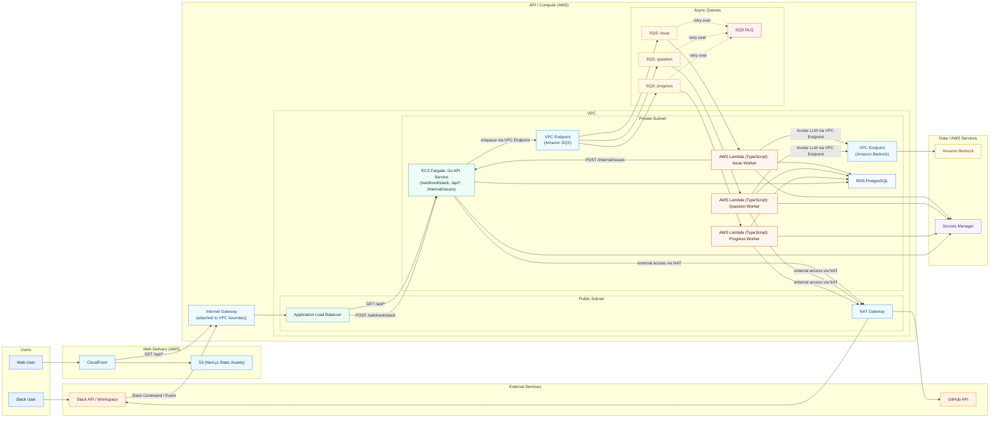

# Infrastructure Guidelines

---

# System Architecture

---

# System Components

---

## 1. Request Entry Points

### Slack

- Slash Command / Event / Action は `Internet Gateway` 経由で VPC 内の `ALB` の `POST /webhook/slack` を呼ぶ
- `ECS Go API Service` は署名検証と重複排除を行い、3秒以内に `200 OK` を返す
- 重い処理は `SQS` に投入して非同期化する

### Web

- `CloudFront` 経由で Web UI を配信（静的アセットは `S3`）
- ダッシュボード用 API は `CloudFront -> Internet Gateway -> ALB -> ECS Go API Service -> RDS` で取得

---

## 2. Async Processing（SQS + Lambda Worker）

### Queue構成

- `SQS progress`: `/progress` 系イベント
- `SQS question`: `/question` 系イベント
- `SQS issue`: Issue化イベント
- 失敗メッセージは `DLQ` へ移送

### Worker構成

- `Progress Worker (AWS Lambda / TypeScript)`
  - 進捗を `RDS PostgreSQL` に保存
  - `#progress-board` に投稿
- `Question Worker (AWS Lambda / TypeScript)`
  - `VPC Endpoint (Amazon Bedrock)` 経由で一次回答を生成
  - 継続回答に必要な `question_sessions` を `RDS PostgreSQL` に記録
  - 必要時はメンター向け転送
- `Issue Worker (AWS Lambda / TypeScript)`
  - `VPC Endpoint (Amazon Bedrock)` 経由でスレッドを要約
  - `ECS Go API Service` の内部エンドポイント `POST /internal/issues` を呼び出し
  - `ECS Go API Service` が GitHub Issue を作成
  - Slackスレッドへ Issue URL を返却

---

## 3. Data / Security

### Data Store

- `RDS PostgreSQL`: チーム情報、進捗、質問、Issue連携結果、Slack再送対策用キー、継続回答セッション状態

### Security

- `Secrets Manager` で Slack/GitHub/LLM の秘匿情報を管理
- `ECS Task Role` / `Lambda Execution Role` ごとに最小権限IAMを付与
- 署名検証は Webhook 受信時の必須処理
- `ALB` は VPC の Public Subnet に配置し、外部公開の入口を一本化する
- `ECS API` / `Lambda Worker` と `RDS` は Private Subnet に配置する
- `ECS API` から `SQS` への送信は `VPC Endpoint (Amazon SQS)` 経由とする
- `Question Worker` / `Issue Worker` から `Amazon Bedrock` への通信は `VPC Endpoint` 経由とする
- `Issue Worker` から GitHub への直接通信は行わず、`ECS Go API Service` の内部エンドポイント経由で Issue を作成する
- Private Subnet から外部API（Slack / GitHub）へ出る通信は `NAT Gateway` 経由とする
- `NAT Gateway` は外向き通信専用とし、外部からの受信は `Internet Gateway + ALB` で受ける

---

# 設計意図

---

## Slack 3秒制約を満たすために

- 受信時は「検証 + SQS投入」だけに限定
- LLM呼び出しやIssue作成は必ず `Lambda Worker` へ分離

理由:

- Slackのタイムアウトを避けるため
- 外部API遅延をユーザー応答時間に影響させないため

---

## 小規模MVPで運用コストを抑えるために

- Computeは `ECS Fargate (API)` と `AWS Lambda (Worker)`、非同期は `SQS` に統一
- まずは単一リージョンで運用し、必要時のみ拡張

理由:

- チーム規模が小さく、常時運用要員が限られるため
- AWSマネージドを使う方が立ち上がりが速いため

---

## データ整合性と柔軟性を両立するために

- 正規データは `RDS PostgreSQL` へ集約
- MVPでは状態管理を単一DBに寄せて運用を単純化する

理由:

- 集計/参照の土台はRDBが扱いやすい
- 初期運用ではデータストアを増やさない方が構成を維持しやすい

---

## Vector/RAGは段階導入にする

- 初期は導入しない（MVP範囲外）
- 必要になった場合のみ `pgvector` もしくは専用Vector DBを追加

理由:

- 現時点の要件は「進捗可視化・Q&A・Issue化」が中心
- 先に運用実績を作る方が合理的

---

# スケーリング戦略

---

## 水平スケール

| 対象 | 方法 |
| --- | --- |
| CloudFront | AWS管理で自動スケール |
| ALB | AWS管理で自動スケール |
| ECS API Service | Service Auto Scaling（CPU/Memory/Request数） |
| Lambda Worker | SQSトリガーで自動スケール（必要時はReserved Concurrencyで制御） |
| SQS | バッファリングでスパイク吸収 |
| RDS PostgreSQL | 初期は単一構成、必要時にリードレプリカ追加 |

---

## 局所アクセス対策

- Webhook APIに必要最小限の処理だけを残す
- Queue滞留時は該当Workerのみタスク数を段階的に引き上げる
- 外部API障害時はDLQへ退避し、手動再実行可能にする
