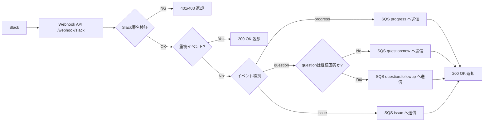
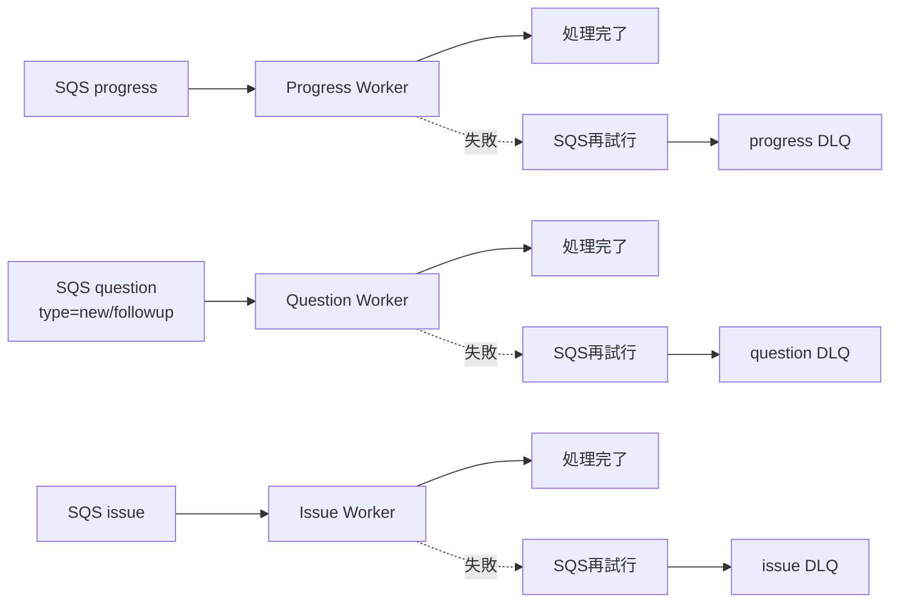
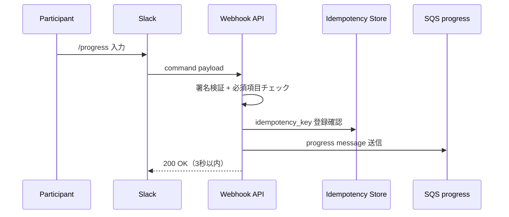
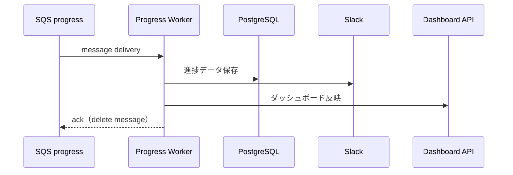
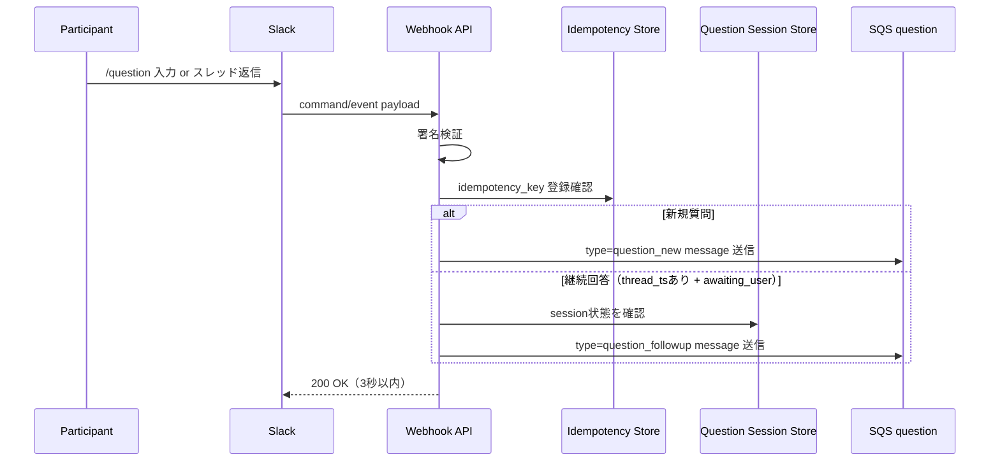
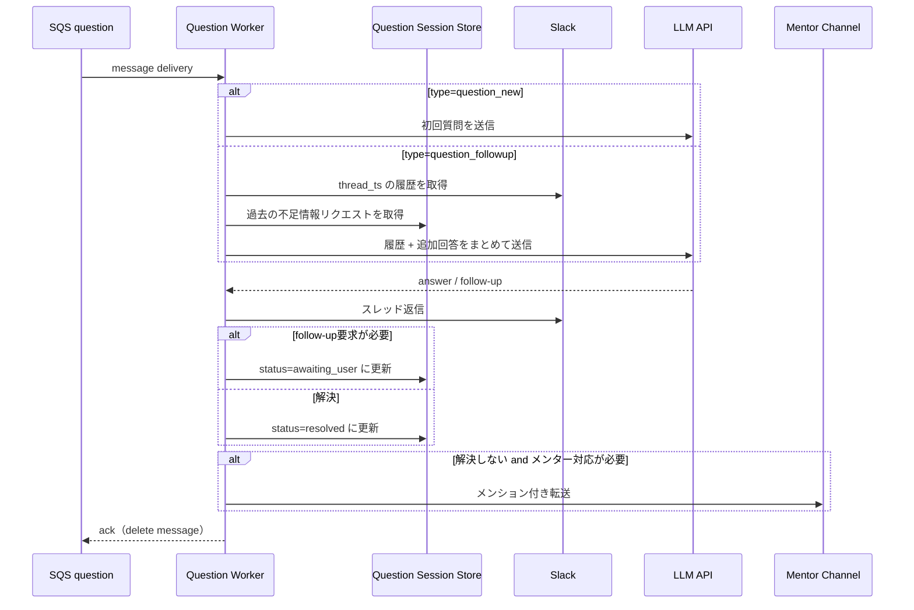
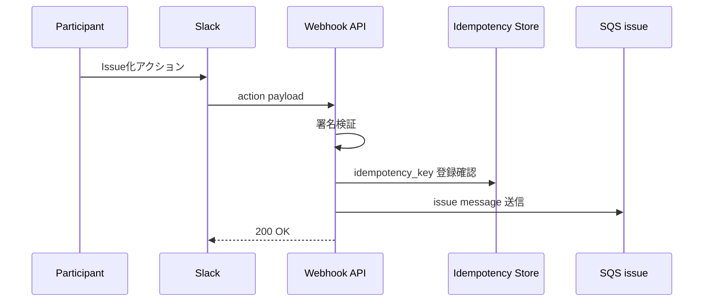
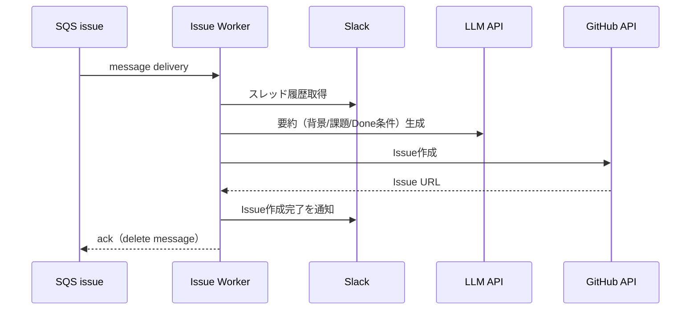
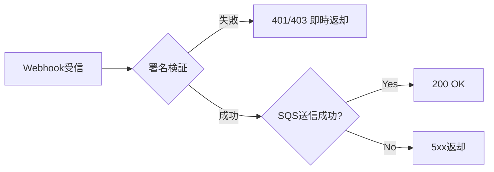
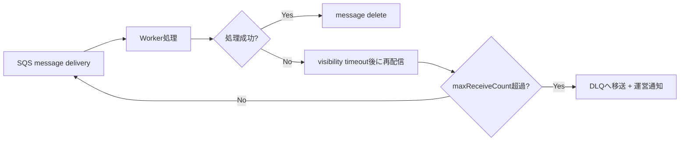

# 🔄 処理フロー設計（MVP / SQSパターン）

---

## 0. 設計前提

| 項目 | 内容 |
| --- | --- |
| 対象機能 | `/progress`、`/question`、Slack議論のIssue化、Webダッシュボード表示 |
| イベント起点 | Slack Slash Command / Slack Action |
| 受信方式 | `POST /webhook/slack` で全イベントを受信 |
| 非同期方針 | 受信処理は署名検証・重複チェック・SQS投入までで終了し、3秒以内に `200 OK` を返却 |
| 実行方式 | SQS Consumer（Worker）が非同期で本処理を実行 |
| キュー構成 | `progress` / `question` / `issue` の3キュー（各キューにDLQ設定） |
| question分岐 | `thread_ts` + `question_sessions` を使って「新規質問 / 継続回答」を判定 |
| 主要コンポーネント | Slack、Webhook API、Idempotency Store、Question Session Store、SQS、Worker、PostgreSQL、LLM、GitHub API |

---

## 1. フェーズ分割

### 1.1 受信フェーズ（同期・ここでHTTP処理は終了）

### 1.2 実行フェーズ（非同期・受信後に別処理として実行）

---

## 2. `/progress` フロー

### 2.1 受信フロー（同期）

### 2.2 実行フロー（非同期）

---

## 3. `/question` フロー

### 3.1 受信フロー（同期）

### 3.2 実行フロー（非同期）

---

## 4. Slack議論のIssue化フロー

### 4.1 受信フロー（同期）

### 4.2 実行フロー（非同期）

---

## 5. エラーフロー分離

### 5.1 受信フェーズの失敗（同期）

### 5.2 実行フェーズの失敗（非同期）

